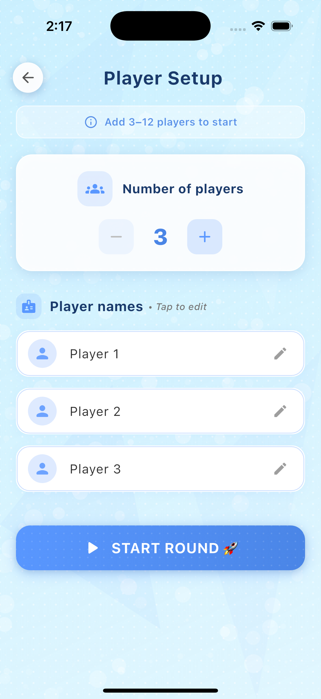
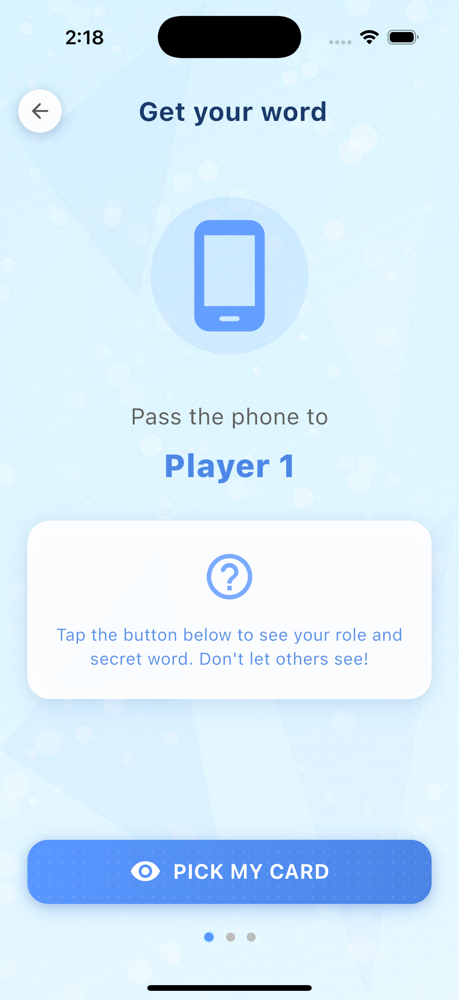
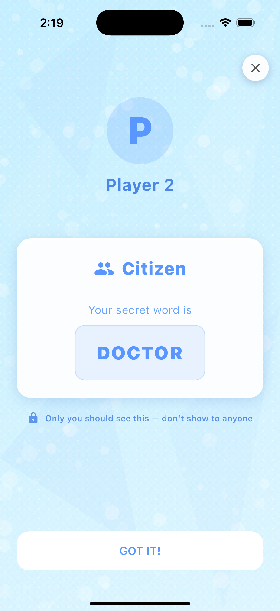
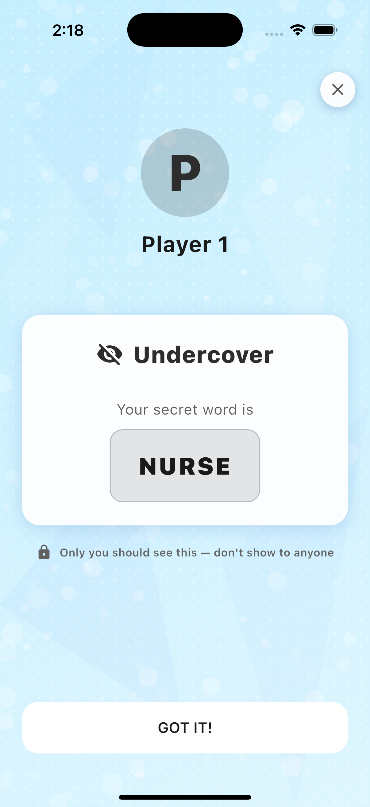
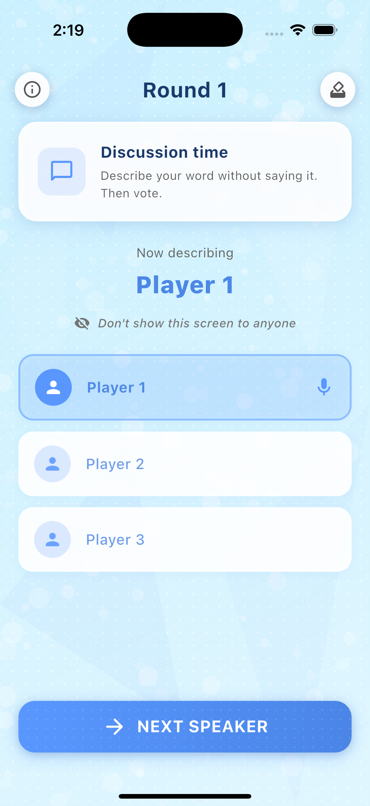
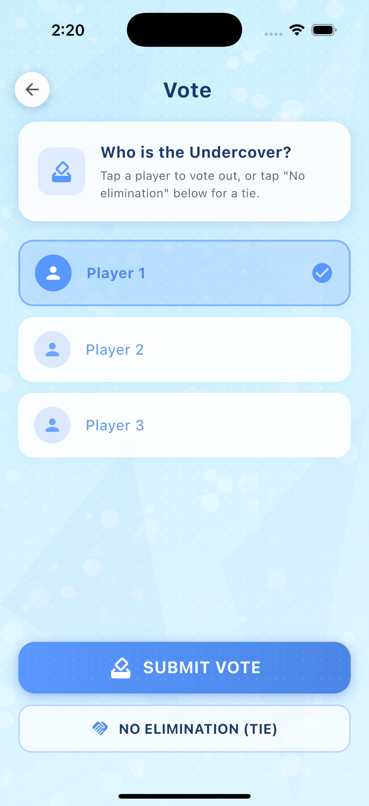
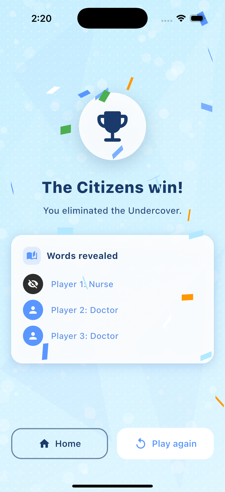
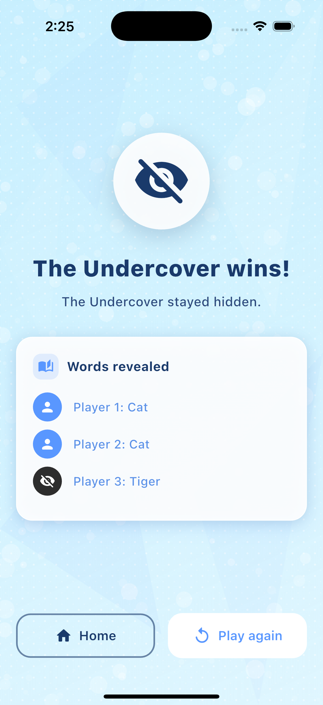

# Unsaid — Undercover Game Clone

A Flutter mobile party game based on the social deduction game **Undercover**. One player is the Undercover with a different secret word; the rest are Citizens. Players describe their word without saying it, then vote to eliminate the Undercover.

---

## How to run the app

### Prerequisites

- **Flutter SDK** (stable channel). Install from [flutter.dev](https://flutter.dev).
- A device or emulator (iOS, Android, or web).

### Steps

1. **Open the project** and go to the app directory:
   ```bash
   cd unsaid
   ```

2. **Install dependencies:**
   ```bash
   flutter pub get
   ```

3. **Run the app:**
   ```bash
   flutter run
   ```
   - With a specific device: `flutter run -d <device_id>` (use `flutter devices` to list IDs).
   - For web: `flutter run -d chrome`.

4. **Optional — build for release:**
   - Android: `flutter build apk`
   - iOS: `flutter build ios`
   - Web: `flutter build web`

---

## App structure

High-level layout of the codebase and how screens connect.

### Entry point

| File | Purpose |
|------|--------|
| `lib/main.dart` | App entry: `runApp(UnsaidApp)`, Material theme, and `HomeScreen` as the initial route. |

### Core (`lib/core/`)

| File | Purpose |
|------|--------|
| `app_theme.dart` | Theme colors (primary blue, header color, undercover/citizen), `AppTheme.lightTheme`, and shared button/input styles. |
| `word_pairs.dart` | Predefined word pairs (e.g. Cat/Tiger, Coffee/Tea) used to assign secret words to players. |

### Models (`lib/models/`)

| File | Purpose |
|------|--------|
| `player.dart` | Player model: name, role (citizen/undercover), secret word, eliminated flag. |
| `game_state.dart` | Game state: phase (setup → roleDistribution → describing → voting → ended), players, current round, votes, and win-condition logic. |

### Screens (`lib/screens/`)

| Screen | Purpose |
|--------|--------|
| `home_screen.dart` | Welcome screen with background image, “Start Game” and rules/instructions access. |
| `player_setup_screen.dart` | Set number of players (3–12) and enter names; starts the game and navigates to role distribution. |
| `role_distribution_flow_screen.dart` | Pass-the-phone flow: prompts each player in turn to tap and see their role and secret word privately. |
| `game_rounds_screen.dart` | Discussion phase: shows current round and whose turn it is to describe their word (without saying it). |
| `voting_screen.dart` | Vote for one player to eliminate, or “No elimination” on a tie; then next round or win. |
| `win_screen.dart` | Shows winner (Citizens or Undercover), reveals all words, and offers Home / Play again. |
| `instructions_screen.dart` | Multi-page rules (Civilians, Undercover, Get your word, Discussion, Vote, Winning). |

### Shared UI (`lib/widgets/`)

| File | Purpose |
|------|--------|
| `game_screen_background.dart` | Shared gradient + pattern background and helpers (e.g. `gameScreenPrimaryButton`, `gameScreenIconButton`) for in-game screens. |
| `patterned_background.dart` | Reusable patterned background used by the game background. |

### Flow summary

```
Home → Player setup (names) → Role distribution (each sees role + word) 
     → Game rounds (describe) → Voting → Eliminate or tie 
     → Repeat until win → Win screen → Home / Play again
```

Instructions are available from the home screen and do not affect the game flow.

---

## Screenshots


| Screen | Image |
|--------|--------|
| Home |  |
| Player setup |  |
| Player setup 2 |  |
| Role Distribution for Citizens |  |
| Role Distribution for Undercover |  |
| Game round |  |
| Voting |  |
| Citizin Win |  |
| Undercover Win |  |

